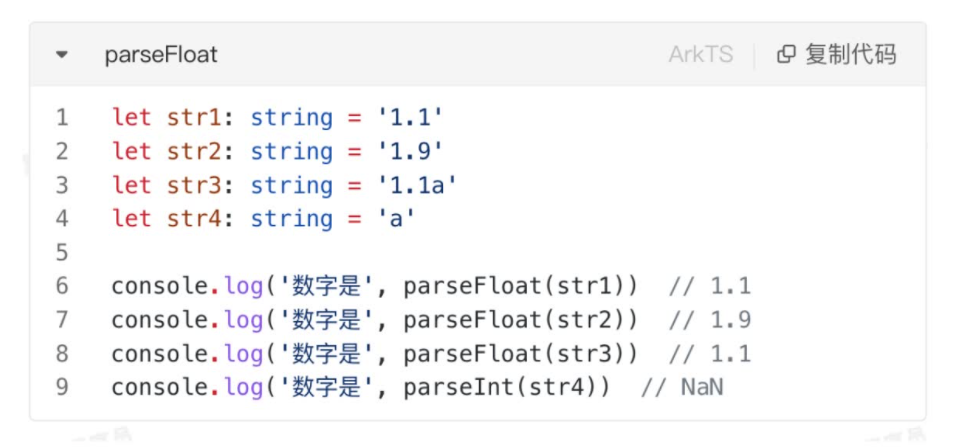
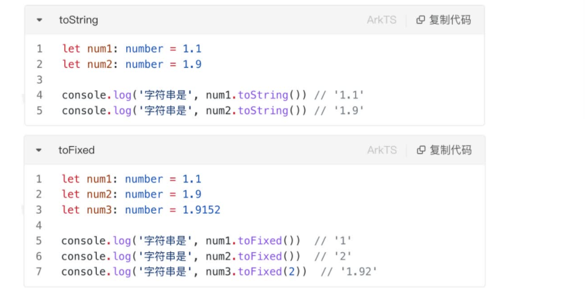
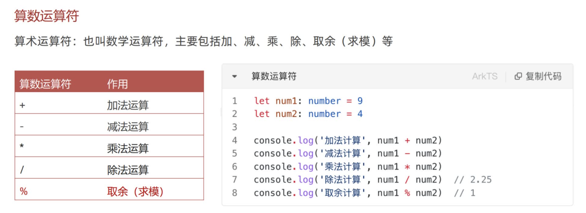
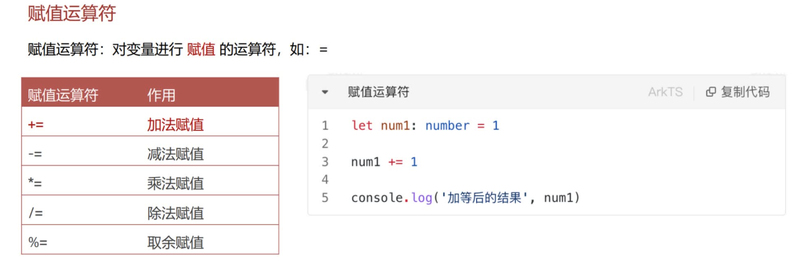
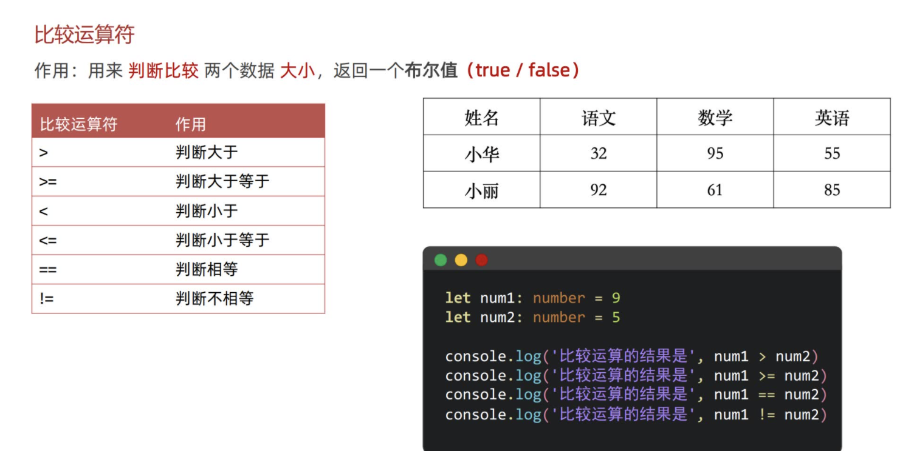
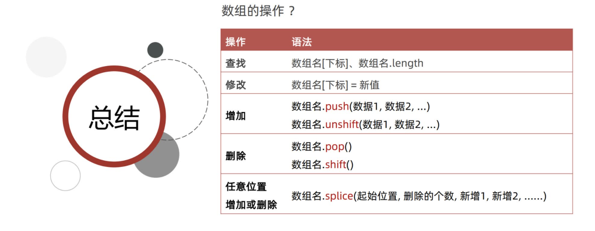

# 目录

- [常见的装饰器有哪些?](##1)
- [事件绑定的几种方式？](##2)
- [自定义组件的基础使用？](##1)
- [svg 图标的使用？](##1)
- [布局元素的组成?](##1)
- [组件添加边框语法？](##1)
- [组价圆角的设置？](##1)
- [背景图片的属性？](##1)
- [线性布局--主轴排列方式&&交叉轴的排列方式？](##1)
- [弹性布局？](##1)
- [绝对定位和层级 Zindex？](##1)
- [字符串的拼接？](##1)
- [数字和字符串的类型转换？](##1)
- [运算符号？](##1)
- [数组的操作？](##1)
- [ForEach 的基础使用？](##1)
- [Grid 布局的基础使用？](##1)
- [@Extend 的使用？@Styles 的使用？@Builder 的使用?](##1)
- [class 类的基础用法](##1)
- [数据类型的判断？](##1)
- [类的修饰符有哪些？](##1)
- [剩余参数和展开运算符的应用？](##1)
- [接口的继承和实现？](##1)
- [泛型函数？泛型约束？多个泛型参数？泛型接口？泛型类？](##1)
- [模块化语法的使用？](##1)
- [自定义组件中的成员变量和成员函数？](##1)
- [使用@BuildParams 修饰器接收父组件中传递 UI？](##1)
- [状态管理@state 和@prop](##1)
- [](##1)
- [](##1)

## 常见的装饰器有哪些?

1. @Entry:表示的是入口自定义组件
2. @Component：表示的是自定义组件
3. @state：表示的是响应式状态变量

## 事件绑定的几种方式？

1. 第一种绑定事件的方式使用箭头函数

```
Button('放大').onClick((event: ClickEvent) => {
  this.fontSize += 4
})
```

2. 第二种绑定事件的方式使用普通函数(目前这种用法会提示使用箭头函数去替换)

```
Button('放大').onClick(function(): void {
  this.fontSize += 4
}.bind(this))
```

3. 第三种使用自定义函数的形式

```
clickBig(): void {
  this.fontSize += 4
}
Button('放大').onClick(this.clickBig.bind(this))
```

## 自定义组件的基础使用？

详情可以见 case 下面的 customComponent.ets 案例。

## svg 图标的使用？

1. svg 图标的特点：随意放大缩小都不会失侦，同时可以使用 fillColor 属性改变它的颜色。
2. 鸿蒙官网提供了 svg 的图标库：https://developer.huawei.com/consumer/cn/design/harmonyos-icon/
3. 使用方式：
   第一步去官方网站去下载图标，然后复制到项目的 resources>base>media 目录下
   第二步在项目中使用 Image 组件加载资源 `Image($r{app.media.aaa})`

## 布局元素的组成?

1. 布局元素由 4 个部分组成，分别是内容，内边距，边框，外边距。
2. padding 的语法有两种：
   第一种：设置一个元素的内边距相同：比如：`Text('一行文字').padding(20)`
   第二种：分别设置不同的内边距：比如：`Text('一行文字').padding({top:20,right:10,left:5,buottom:0})`
3. 同理外边距的写法相同。

## 组件添加边框语法？

1. 元素的边框有两种，第一种是设置上下左右边框相同。
   例如：`Text('普通边框').border({width: 2,color: 'red',style: BorderStyle.Dashed})`
2. 设置单边的边框：注意的是这里的 width 是必填的，其他不是。

```javascript
Text('两边边框').border({
  width: { left: 2, right: 3 },
  color: { left: '#999', right: 'blue' },
  style: {
    left: BorderStyle.Solid,
    right: BorderStyle.Dashed
  }
})
```

## 组价圆角的设置？

1. 常见的组件圆角有两种，第一种是设置 4 条边的圆角相同。

```javascript
Text('普通') // 普通圆角
  .backgroundColor('#ccc')
  .padding(10)
  .borderRadius(10)
```

2. 第二种是分别设置不同的边。

```javascript
Text('单独边圆角').backgroundColor('#ccc').padding(10).borderRadius({
  topLeft: 10,
  bottomRight: 10
})
```

## 背景图片的属性？

1. 设置背景颜色的属性是 backgroundColor

2. 设置背景图片的属性是 backgroundImage：其中第一个参数是加载的图片地址，写法是使用`$r('图片路径')`，第二个参数是是否平铺，属性是枚举 ImageRepeat，枚举值有 NoRepeat 不平铺，以及 X，Y，XY。

3. 设置背景图片的位置，backgroundImagePosition，使用方式有两种，可以传递对象 xy，例如：`{x:200,y:100}`也可以使用枚举的方式 Alignment.TopEnd 代表 x 轴的结束位置。

4. 设置图片的尺寸 backgroundImageSize，第一种设置宽高对象`{width:100,height:200}`，第二种设置枚举 ImageSize，枚举中有两个属性。
   第一个：Contain，等比例缩放背景图片，当宽或者高和组件的尺寸相同时停止缩放。
   第二种：Cover，等比例缩放背景图片，当背景图片完全覆盖组件的范围。
   第三种：auto：默认值，背景图片原本的大小。

## 线性布局--主轴排列方式&&交叉轴的排列方式？

1. 设置主轴排列方式的属性是 justifyContent，属性值是一个枚举属性 FlexAlign，属性有以下几种。
   Start：默认的排列方式，主轴的开始位置。
   Center：主轴的中心位置。
   End：主轴的结束位置。
   SpaceBetween：元素的两边贴边显示，元素之间距离相等。
   SpaceAround：元素之间的距离是元素与边界距离的 2 倍。
   SpaceEvenly：元素之间的距离和元素与盒子边界距离相等。

2. 设置交叉轴排列方式的属性是 alignItems，属性有两个枚举，分别是：
   交叉轴是水平的 HorizontalAlign.Start，HrizontalAlign.Center,Horizontal.End
   交叉轴是垂直的 Vertical.Top, Vertical.Center,Vertical.Bottom

3. 设置元素对于剩余空间的占据，layoutWeight：
   被设置的元素会按照权重去分配主轴的剩余空间，设置的值越大，分配的剩余空间越大。

## 弹性布局？

1. 暂时不总结

## 绝对定位和层级 Zindex？

1. 暂时不总结

## 字符串的拼接？

1. 第一种使用+进行拼接。
2. 第二种使用模版字符串的形式。

## 数字和字符串的类型转换？

1. 字符串转数字？
   Number()：当字符串中包含非数字时会转换成 NaN

   parseInt()：去掉小数部分转数字，转换失败返回 NaN
   

   parseFloat()：保留小数部分转数字，转换失败返回 NaN
   

2. 数字转字符串？
   toString()：数字直接转字符串
   toFixed()：四舍五入转字符串，可设置保留几位小数
   

## 运算符号？

1. 算数运算符。
   

2. 赋值运算符。
   

3. 一元运算符。
   

4. 比较运算符。
   

## 数组的操作？

1. 

## ForEach 的基础使用？

1. ForEach 使用用于遍历数据的使用，第一个传递的数据是一个数组，第二个参数是一个回调函数，回调函数中第一个参数是数组中的每一项，第二个参数是下标。

## Grid 布局的基础使用？

1. 网格布局中使用 Grid 包裹需要实现布局的元素。同时每一个网格中使用 GridItem 进行布局。
2. Grid 属性使用：使用 columnsTemplate 设置纵向有多少列：`.columnsTemplate("1fr 1fr 1fr ")`。使用 rowsTemplate 设置横向有多少行：`.rowsTemplate('1fr 1fr 1fr 1fr')`，上面的设置就是一个 4 行 3 列的布局，如果需要设置行列之间的空隙可以使用，rowsGap 或者 columnsGap，例如：` .rowsGap(10).columnsGap(10)`。

## @Extend 的使用？@Styles 的使用？@Builder 的使用?

1. Extend 用于扩展组件的样式和事件。
2. Extend 的支持传递参数。

```js
@Extend(Text)  // 传递是需要扩展的组件名称
function extendText(text: string, color: ResourceColor) {
  .width('100%')
  .height(100)
  .backgroundColor(color)
  .fontSize(40)
  .textAlign(TextAlign.Center)
  .onClick(() => {
    AlertDialog.show({
      message: '轮播图' + text
    })
  })
}
```

@Styles 的使用？

1. 用于定义公共的样式，可以设置全局的，例如：

```js
@Styles
function commonStyles() {
  .width(80)
  .height(80)
}
```

2. 也可以定义局部的样式，与@Extend 的区别是不可以传递参数。

```js
  @Styles  // 设置局部的样式
  setBg() {
    .backgroundColor(Color.Brown)
  }

```

@Builder 的使用?

1. 用于扩展自定义的函数（结构，样式，事件），全局的使用：

```js
@Builder
  navItem(text: string, icon: ResourceStr) {
    Column() {
      Image(icon)
        .width(50)
        .onClick(() => {
          AlertDialog.show({
            message: `点击了${text}`
          })
        })
      Text(text)
        .fontSize(16)
    }
  }
```

2. 也可以局部使用，但是，局部使用的需要使用 this。

```js
NavItem('阿里拍卖', $r('app.media.ic_reuse_01')) // 全局
NavItem('菜鸟', $r('app.media.ic_reuse_02')) // 全局
this.navItem('粑粑农场', $r('app.media.ic_reuse_03')) // 局部
this.navItem('阿里药房', $r('app.media.ic_reuse_04')) // 局部
```

## class 类的基础用法

1. class 类中属性的两种定义方式。
   解释；第一种是字段名加类型并赋予初始值，第二种是字段名加可选链操作符加类型。

```js
class 类名 {
  属性：类型 = 初始值   //  第一种
  属性？：类型 // 第二种
}
// 例如
class Cat {
  name: string = 'Tom'
  sex?: string
}
```

2. 通过构造函数实例化对象。
   解释：在 new 一个类的过程中会先创建一个对象，这个对象中有 name 和 age 属性，但是没有被赋值。当调用 constructor 的时候实际是将类中的 this 指向创建的实例对象。

```js
// 例如1： 在constructor中分别传入不同的属性
class Dog {
  name: string
  age: number

  constructor(name: string, age: number) {
    this.name = name
    this.age = age
  }
}
let d1 = new Dog('小黑', 20)
let d2 = new Dog('奇奇', 10)
console.log('name:', d1.name) // 小黑
console.log('name:', d2.name) // 奇奇

// 例如2:在constructor中分别传入一个对象。
interface IDog {
  name: string
  age: number
}

class Dog {
  name: string
  age: number

  constructor(params: IDog) {
    this.name = params.name
    this.age = params.age
  }
}

let d1 = new Dog({
  name: '小黑',
  age: 20
})
let d2 = new Dog({
  name: '奇奇',
  age: 10
})
console.log('name:', d1.name); // 小黑
console.log('name:', d2.name); // 奇奇
```

上面的写法是通过传递一个对象的形式传递参数，如果有多个参数可以放在一个对象中，这样做的好处是当需要传递多个参数的时候，可以不区分传递顺序。

3. 向类中定义方法，介绍静态属性和静态方法。
   总结：添加静态属性和静态方法是通过属性和方法前面添加 static 字段，同时对于静态属性和方法的访问需要通过类名进行访问。向类中添加方法，直接在类中定义方法就可以，但是值得注意的是普通的方法中可以使用 this，静态方法中不可以使用 this。

```js
class Person {
  name: string
  static sex: string // 添加静态属性

  constructor(name: string) {
    this.name = name
  }

  static sayAge(age: number) {
    console.log(`hello 我的年龄是${age}`)
  }

  // 向类中定义方法
  sayHi() {
    console.log(`hello 我是${this.name}`)
  }
}

let p1 = new Person('张三')
p1.sayHi() // hello 我是张三
Person.sayAge(20) // hello 我的年龄是20
```

4. extends 继承和 super 关键字
   总结：在类中通过 extends 关键字可以实现类的继承，在子类中的 constructor 中通过 super 关键字去继承父类中的属性，同时可以在子类中定义自己的方法和属性，当自己定义的方法和父类中的方法重名的时候就会重写父类的方法，同时可以使用 super 关键字去调用父类的方法。

```js
class Person {
  name: string
  age: number

  constructor(name: string, age: number) {
    this.age = age
    this.name = name
  }

  sayHello() {
    console.log(`我是${this.name},我的年龄是${this.age}`)
  }
}

class Student extends Person {
  // 继承父类
  grade: string // 自己的属性

  constructor(name: string, age: number, grade: string) {
    super(name, age) // 继承父类的构造函数
    this.grade = grade // 指定自己的属性
  }

  sayHello(): void {
    super.sayHello() // 调用父类的方法
    console.log(`我是${this.name},我的年龄是${this.age},我的班级是${this.grade}`)
  }

  sayHi(): void {
    console.log('你好啊！！！')
  }
}

let S1: Student = new Student('张三', 14, '二班')
S1.sayHello() // 调用父类的方法，同时也是重写父类的方法
S1.sayHi() // 调用自己的方法
```

## 数据类型的判断？

1. 简单数据类型的判断使用的 typeof，复杂数据类型的判断使用的 instanceof

```js
console.log(typeof 222) // number
console.log(typeof 'hello') // string
console.log(typeof true) // boolean
console.log(typeof [1, 2]) // object

class Person {}

class Student extends Person {}

let p = new Person()
let s = new Student()

console.log('判断结果：', p instanceof Person) // true
console.log('判断结果：', s instanceof Person) // true
console.log('判断结果：', p instanceof Student) // false
```

## 类的修饰符有哪些？

1. 常见的类的修饰符有四种，分别是 public（修饰公共的属性）、private（修饰私有属性）、 protected（修饰受保护的属性）、readonly（只读属性）

```js
private name: string // 私有属性，只能类的内部可以访问和修改
protected age: number // 受保护的属性，只能在类的内部以及子类的内部访问修改
readonly idNumber: number // 只读属性，不可以修改，没有访问限制
public grade: string // 公共属性，默认可以不写 public，没有访问限制
```

## 剩余参数和展开运算符的应用？

1. 这里的剩余参数和 js 中的用法相同，比如实现一个累加的功能

```js
function sum(n1: number, n2: number, ...otherN: number[]) {
  let total = n1 + n2
  // 遍历剩余参数，如果有剩余参数就继续累加
  // console.log('剩余参数', otherN)
  for (let item of otherN) {
    total = total + item
  }
  console.log('total', total)
}

sum(1, 2) // 3
sum(1, 2, 3, 4, 5) // 15
sum(1, 2, 3, 4, 5, 6) // 21
```

2. 展开运算符的应用，这里的展开运算符只能用于数组，不可以用于对象。

```js
let arr1 = [1, 2, 3]
let arr2 = [2, 3, 4]
let arr = [...arr1, ...arr2]
console.log('数组合并', arr) //1,2,3,2,3,4
```

## 接口的继承和实现？

接口的继承：指的是一个接口继承了另一个接口的属性和方法，那么在定义字段的时候需要满足当前的接口和继承的接口。

```js
interface IAnimal {
  name: string;
}

interface ICat extends IAnimal {
  color: string;
}

const cat: ICat = {
  name: '加菲猫',
  color: '灰色'
}
```

接口的实现：接口的实现指的是先定好一个接口，然后通过 implements 关键字去约束接口的属性和方法。

```js
interface IAnimal {
  name: string;
  color: string;
  jump: () => void;
}

class Dog implements IAnimal {
  name: string
  color: string

  constructor(name: string, color: string) {
    this.name = name
    this.color = color
  }

  jump() {
    console.log('我会跳')
  }
}
```

## 泛型函数？泛型约束？多个泛型参数？泛型接口？泛型类？

1. 什么是泛型函数？
   泛型函数指的的是对于函数的传递的参数一开始并不指定类型，而是在使用的时候采取主动指定类型的方式，这种类型不确定方式就是泛型。

```ts
function cat<T>(params: T): T {
  return params
}

cat<string>('小黄')
cat<number>(123)
cat<boolean>(false)
```

2. 什么是泛型约束？
   泛型约束指的是对于传递的泛型参数进行限制，使用关键字 extends 进行限制的方式。
   比如：下面的案例就是约束对于传递的参数必须满足有 length 属性，所以可以传递 string 或者数组等

```js
interface ILength {
  length: number
}

function fn<T extends ILength>(params: T) {
  return params
}

fn<string>('hello')
fn<number[]>([1, 2, 3])
```

3. 什么是多个泛型参数？
   指的对于传递的泛型参数传递多个。

```ts
function cat<T, F>(params1: T, params2: F): F {
  return params2
}
cat<string, number>('小黄', 12)
```

4. 泛型接口：指的是在定义接口的时候不指定具体的类型，而是在使用接口或者实现接口的时候才去定义具体的类型。

```ts
interface IdFunc<T> {
  id: (value: T) => T
  ids: () => T[]
}

let obj: IdFunc<number> = {
  id: (value: number) => value,
  ids: () => [1, 2, 3]
}

let obj2: IdFunc<string> = {
  id: (value: string) => value,
  ids: () => ['1', '2']
}
```

5. 泛型类：指的是定义类的时候结合泛型进行定义，叫做泛型类。

```ts
class Animal<T> {
  id: T

  constructor(id: T) {
    this.id = id
  }
}

let A = new Animal<string>('小灰')
let B = new Animal<number>(22)
```

## 模块化语法的使用？

1. 什么是模块化：模块化指的是一个大的程序进行切分，分为一个个小的模块。
   模块化常见的导入导出方式有三种：分别是默认导入导出，按需导入导出，以及全部导入。

```ts
默认导出 let a = 1 export default a
默认导入 import aa from './module'

按需导出 export let a = 1
按需导入 import {a} from "./module"
按需导出后重新命名 import {a as aa} from "./module"

全部导入 import * as utils from './module'
```

## 自定义组件中的成员变量和成员函数？

1. 什么是成员变量？什么是成员函数？
   成员变量指的的是在自定义主组件中定义的成员变量的值或者函数，可以通过外部传递参数的方式进行覆盖，实现组件的定制化需求。
   成员函数指的是在组件中自己的函数，不可以通过外部传递的参数进行覆盖的。

```ts
  // 1. 例如在head自定义组件中分别定义的不同的成员变量和成员函数：
  // 成员变量 --数据
  title: string = '默认标题'
  more: string = '查看更多'
  // 成员变量--函数
  getMore = () => {
    AlertDialog.show({
      message: `${this.title}`
    })
  }

  // 成员函数
  sayHello() {
    console.log('hello')
  }

  // 2. 在父组件中去覆盖成员变量，实现定制化的需求；
        head({
          title: '我的订单',
          more: '全部订单>',
          getMore: () => {
            AlertDialog.show({
              message: `点击了全部订单`
            })
          }
        })
        head({
          title: '小米有品众凑',
          more: '七款订单众筹中>',
          getMore: () => {
            AlertDialog.show({
              message: `点击了七款订单众筹中`
            })
          }
        })

```

## 使用@BuildParams 修饰器接收父组件中传递 UI？

1. @BuildParams 如何使用？
   父组件中使用尾随闭包的形式传递 ui 结构，有点像 solt 的形式，在子组件中使用@BuildParams 装饰器接收传递过来的 UI，这里需要设置默认的 build

```ts
// 1.在父组件中传递不同的UI
      Column({ space: 20 }) {
        sonCom() {
          // 这里是传递给子组件的UI结构（尾随闭包）
          Text('我是第一个ui')
        }
        sonCom() {
          Button('我是第二个ui')
        }
      }
// 2.在子组件中接收传递的UI
@Component
struct sonCom {
  // 接收外部传递过来的ui，并设置默认的build
  @BuilderParam contentBuilder: () => void = this.defaultBuilder

  // 定义默认的build结构
  @Builder
  defaultBuilder() {
    Text('默认的内容')
  }

  build() {
    Column() {
      Row() {
        this.contentBuilder()
      }
      .height(50)
    }
    .width('100%')
    .borderRadius(4)
    .backgroundColor(Color.White)
  }
}
```

## 状态管理@State，@Prop，@Link

1. @State 如果管理响应式数据？
   @State 装饰器修饰变量可以在变量发生变化的时候触发状态的更新，值得注意的时候，使用@State 修饰的变量只会对基础数据类型以及对象的第一层数据进行监听，如果对于嵌套的对象中数据的修改并不会出发页面的刷新。

```ts
      Row({ space: 10 }) {
        Text(`${JSON.stringify(this.Person)}`)
          .fontSize(12)
        Button('修改爱好').onClick((event: ClickEvent) => {
          this.Person.name = '李四' // 数据发生了改变，ui更新
          this.Person.hobby.one = '看书' // 数据发生了改变，但是ui没有更新
          console.log('Person', JSON.stringify(this.Person))
        })
      }
      .backgroundColor(Color.Gray)
      .padding(10)
      .width('100%')
```

2. @Prop 如何管理响应式数据？
   @Prop 用于管理父组件传递过来的数据，当父组件中传递的数据发生变化的时候使用@Prop 装饰的变量也会触发 UI 的刷新，当时 prop 中数据是单项数据流的，也就是修改父组件传递的数据并不会让父组件的响应式数据发生变化，如果需要同步修改父组件中的数据，需要父组件传递一个回调函数，然后通过调用父组件的回调函数让父组件去修改状态。

```ts
// 父组件中
      Row({ space: 10 }) {
        Text(this.gift)
        Button('爸换车').onClick((event: ClickEvent) => {
          this.gift = '本田'
        })
        sonC({
          gift: this.gift,
          changeCar: (value: string) => {
            this.gift = value
          }
        })
      }
      .backgroundColor(Color.Pink)
      .padding(10)
      .width('100%')

// 子组件中
  @Prop gift: string = ''
  changeCar = (value: string) => {
  }

  build() {
    Row({ space: 10 }) {
      Text(this.gift)
      Button('儿换车').onClick((event: ClickEvent) => {
        this.changeCar('劳斯奈斯')
      })
    }
  }
```

3. @Link 可以使用父子组件数据的双向数据绑定，具体的使用场景和@Prop 相同

##

##

##

##

##

##

##

##

##

##

##

##

##

##

##

##

##

##

##

##

##

##

##

##

##

##

##

##

##

##

##

##

##

##

##

##

##

##

##

##

##

##

##

##

##

##

##

##

##

##

##

##

##

##

##

##

##

##
