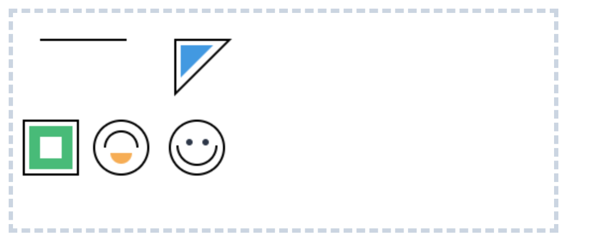

# Canvas 详解

## Canvas 绘制基础图形详解

Canvas 是 HTML5 核心绘图 API，支持在网页中动态绘制矢量图形。本文将系统讲解 Canvas 基础图形（线条、三角形、矩形、圆形）及组合图形（笑脸）的绘制方法，并附带完整代码与关键说明。

### 一、基础环境搭建（HTML + CSS + 初始化）

首先创建 Canvas 容器与绘图上下文，设置基础样式确保绘图区域清晰可见。

```html
<style>
  /* 容器样式：优化布局与视觉效果 */
  .canvas-container {
    background-color: #f8fafc; /* 浅灰背景，区分页面其他区域 */
    padding: 20px;
    max-width: 600px;
    margin: 20px auto; /* 水平居中 */
    border-radius: 8px; /* 圆角优化 */
    box-shadow: 0 2px 4px rgba(0, 0, 0, 0.1); /* 轻微阴影增强层次感 */
  }
  /* Canvas 样式：明确绘图边界 */
  #basic-canvas {
    border: 4px dashed #cbd5e1; /* 虚线边框，区分画布区域 */
    background-color: #ffffff; /* 白色画布，便于观察图形 */
    border-radius: 4px;
  }
</style>

<!-- 画布容器 -->
<div class="canvas-container">
  <!-- Canvas 核心元素：width/height 需直接设置（非CSS），确保图形不失真 -->
  <canvas id="basic-canvas" width="500" height="200"></canvas>
</div>

<script>
  // 1. 获取 Canvas 元素与 2D 绘图上下文（核心对象）
  const canvas = document.getElementById('basic-canvas')
  const ctx = canvas.getContext('2d') // 所有绘图操作都通过 ctx 实现

  // 2. 设置公共样式（避免重复代码）
  ctx.lineWidth = 2 // 线条宽度（所有图形通用）
  ctx.strokeStyle = '#2d3748' // 线条颜色（深灰，比黑色更柔和）

  // 3. 页面加载完成后执行绘图（确保 Canvas 已渲染）
  window.addEventListener('load', () => {
    drawLine() // 绘制线条
    drawTriangle() // 绘制三角形
    drawRectangle() // 绘制矩形（原 Square 更准确的命名）
    drawCircle() // 绘制圆形
    drawSmilingFace() // 绘制笑脸（组合图形）
  })
</script>
```

### 二、Canvas 路径绘制核心 API

在绘制路径之前先介绍几个常用的canvas的api。

1.  beginPath() 新建一条路径，生成之后，图形绘制命令被指向到路径上生成路径。
2.  closePath() 闭合路径之后图形绘制命令又重新指向到上下文中。
3.  stroke() 通过线条来绘制图形轮廓。
4.  fill() 通过填充路径的内容区域生成实心的图形。
5.  moveTo(x, y) 将笔触移动到指定的坐标 x 以及 y 上。
6.  lineTo(x, y) 绘制一条从当前位置到指定 x 以及 y 位置的直线。

### 三、具体图形绘制实现

效果展示：


**1. 绘制直线（基础入门）**

通过 moveTo() 定位起点，lineTo() 绘制线段，最后用 stroke() 渲染轮廓。

```js
function drawLine() {
  ctx.beginPath() // 开启新路径（避免与其他图形混淆）
  ctx.moveTo(25, 25) // 起点：(25,25)（Canvas 左上角为原点 (0,0)）
  ctx.lineTo(105, 25) // 终点：(105,25)（水平向右绘制）
  ctx.stroke() // 渲染直线轮廓
}
```

**2. 绘制三角形（空心 + 实心）**

三角形由三条线段组成，空心需手动闭合路径，实心可直接填充（自动闭合）。

```js
function drawTriangle() {
  // 1. 绘制空心三角形
  ctx.beginPath()
  ctx.moveTo(150, 25) // 顶点1
  ctx.lineTo(200, 25) // 顶点2（水平向右）
  ctx.lineTo(150, 75) // 顶点3（向左下方）
  ctx.closePath() // 闭合路径（连接顶点3与顶点1）
  ctx.stroke() // 渲染空心轮廓

  // 2. 绘制实心三角形（位置偏移，避免与空心重叠）
  ctx.beginPath()
  ctx.moveTo(155, 30) // 顶点1（右移5px，下移5px）
  ctx.lineTo(185, 30) // 顶点2（缩短宽度，更美观）
  ctx.lineTo(155, 60) // 顶点3（上移15px，避免超出范围）
  ctx.fillStyle = '#4299e1' // 单独设置填充色（蓝色）
  ctx.fill() // 填充实心（无需 closePath()，自动闭合）
}
```

**3. 绘制矩形（专用 API，更高效）**

Canvas 为矩形提供了专用方法，无需手动写路径，直接指定位置与尺寸即可。

```js
function drawRectangle() {
  // 1. 空心矩形：strokeRect(x, y, 宽度, 高度)
  ctx.strokeRect(10, 100, 50, 50) // 位置(10,100)，尺寸50x50

  // 2. 实心矩形：fillRect(x, y, 宽度, 高度)（偏移避免重叠）
  ctx.fillStyle = '#48bb78' // 填充色（绿色）
  ctx.fillRect(15, 105, 40, 40) // 位置(15,105)，尺寸40x40

  // 3. 清除矩形区域：clearRect(x, y, 宽度, 高度)（生成“镂空”效果）
  ctx.clearRect(25, 115, 20, 20) // 清除中间20x20区域，变为透明
}
```

**4. 绘制圆形（arc () 方法详解）**

圆形通过 arc() 方法绘制，核心是理解「弧度制」与「绘制方向」。

arc () 方法语法: arc(x, y, radius, startAngle, endAngle, anticlockwise)

- x, y：圆心坐标
- radius：圆的半径
- startAngle/endAngle：起始 / 结束角度（必须用弧度制，公式：`弧度 = (Math.PI / 180) * 角度）`
- anticlockwise：是否逆时针绘制（布尔值，默认 false 顺时针）

```js
function drawCircle() {
  // 1. 绘制完整圆形（360° = 2π 弧度）
  ctx.beginPath()
  ctx.arc(100, 125, 25, 0, Math.PI * 2, false) // 圆心(100,125)，半径25
  ctx.stroke()

  // 2. 绘制上半圆（逆时针，180° = π 弧度）
  ctx.beginPath()
  ctx.arc(100, 125, 15, 0, Math.PI, true) // 半径15，逆时针绘制上半圆
  ctx.stroke()

  // 3. 绘制实心下半圆（顺时针）
  ctx.beginPath()
  ctx.arc(100, 130, 10, 0, Math.PI, false) // 圆心下移5px，半径10
  ctx.fillStyle = '#f6ad55' // 填充色（橙色）
  ctx.fill()
}
```

注意事项：为了保证新的圆弧不会追加到上一次的路径中，在每一次绘制圆弧的过程中都需要使用beginPath()方法。

**5. 绘制组合图形（笑脸）**

通过组合「圆形（脸）+ 小圆（眼睛）+ 半圆（嘴巴）」，实现复杂图形。

```js
function drawSmilingFace() {
  // 1. 绘制脸部轮廓（圆形）
  ctx.beginPath()
  ctx.arc(170, 125, 25, 0, Math.PI * 2, false) // 圆心(170,125)，半径25
  ctx.stroke()

  // 2. 绘制左眼（小圆）
  ctx.beginPath()
  ctx.arc(163, 120, 3, 0, Math.PI * 2, false) // 左眼位置：左移7px，上移5px
  ctx.fillStyle = '#2d3748' // 眼睛颜色（深灰）
  ctx.fill() // 实心眼睛，无需 stroke()

  // 3. 绘制右眼（小圆，与左眼对称）
  ctx.beginPath()
  ctx.arc(178, 120, 3, 0, Math.PI * 2, false) // 右眼位置：右移8px，上移5px
  ctx.fill()

  // 4. 绘制微笑嘴巴（下半圆，顺时针）
  ctx.beginPath()
  ctx.arc(170, 123, 18, 0, Math.PI, false) // 圆心(170,123)，半径18，180°
  ctx.stroke()
}
```

### 四、常见问题与注意事项

1. **Canvas 尺寸设置：** width 和 height 必须直接在 Canvas 标签上设置，若用 CSS 设置会导致图形拉伸失真。
2. **路径隔离：** 每次绘制新图形前，务必调用 beginPath()，否则新图形会与上一次路径叠加。
3. **弧度与角度转换：** arc() 方法仅支持弧度制，需用 `(Math.PI / 180) * 角度` 转换（如 90° = Math.PI/ 2）。
4. **样式优先级：** 若单个图形需要特殊样式（如不同颜色），需在 stroke()/fill() 前单独设置（如 ctx.fillStyle），否则会继承公共样式。

## Canvas 实现电子签名功能

电子签名功能在现代 Web 应用中非常常见，从在线合同签署到表单确认都有广泛应用。本文将带你从零开始，使用 Canvas API 实现一个功能完备的电子签名组件。

### 一、实现思路与核心技术点

实现电子签名的核心思路是追踪用户的鼠标或触摸轨迹，并在 Canvas 上将这些轨迹绘制出来。

**核心技术点：**

- **Canvas API**：用于在网页上动态绘制图形
- **事件监听**：监听鼠标 / 触摸的按下、移动和松开事件
- **坐标转换**：将鼠标 / 触摸事件的坐标转换为 Canvas 元素内的相对坐标
- **线条优化**：通过设置线条属性实现平滑的签名效果

### 二、HTML 结构设计

这是一份简单到爆的html结构，没错，就是这样简单...

```html
<div class="container">
  <p>电子签名</p>
  <canvas id="signatureCanvas" class="signature-border"></canvas>
</div>
```

### 三、CSS 样式设置

为 Canvas 添加一些基础样式，使其看起来像一个签名板。

```css
.container {
  background-color: #fff;
  display: flex;
  flex-direction: column;
  align-items: center;
}

.signature-border {
  width: 98%;
  height: 300px;
  border: 4px dashed #cbd5e1;
  border-radius: 10px;
  cursor: crosshair;
}
```

### 四、JavaScript 核心实现

这是实现签名功能的关键部分，主要包含以下几个步骤：

1.  获取 Canvas 元素和上下文
2.  设置 Canvas 的实际绘制尺寸
3.  定义变量存储签名状态和坐标
4.  实现坐标转换函数
5.  编写事件处理函数
6.  绑定事件监听器

```js
// 获取Canvas元素和上下文
const canvas = document.getElementById('signatureCanvas')
const ctx = canvas.getContext('2d', { willReadFrequently: true })

// 签名状态变量
let isDrawing = false
let lastX = 0
let lastY = 0
let lineColor = '#000000'
let lineWidth = 2

// 初始化Canvas
function initCanvas() {
  // 设置Canvas样式
  ctx.strokeStyle = lineColor
  ctx.lineWidth = lineWidth
  ctx.lineJoin = 'round'
  ctx.lineCap = 'round'

  resizeCanvas()
  window.addEventListener('resize', resizeCanvas)
}

// 响应窗口大小变化
function resizeCanvas() {
  const rect = canvas.getBoundingClientRect()
  const { width, height } = rect
  // 保存当前画布内容
  const imageData = ctx.getImageData(0, 0, canvas.width, canvas.height)
  // 调整Canvas尺寸
  canvas.width = width
  canvas.height = height
  // 恢复画布内容
  ctx.putImageData(imageData, 0, 0)
  // 重新设置绘图样式
  ctx.strokeStyle = lineColor
  ctx.lineWidth = lineWidth
  ctx.lineJoin = 'round'
  ctx.lineCap = 'round'
}

// 获取坐标（适配鼠标和触摸事件）
function getCoordinates(e) {
  const rect = canvas.getBoundingClientRect()
  if (e.type.includes('mouse')) {
    return [e.clientX - rect.left, e.clientY - rect.top]
  } else if (e.type.includes('touch')) {
    return [e.touches[0].clientX - rect.left, e.touches[0].clientY - rect.top]
  }
}

// 开始绘制
function startDrawing(e) {
  isDrawing = true
  lastX = getCoordinates(e)[0]
  lastY = getCoordinates(e)[1]
}

// 绘制中
function draw(e) {
  if (!isDrawing) return
  const [currentX, currentY] = getCoordinates(e)
  ctx.beginPath()
  ctx.moveTo(lastX, lastY)
  ctx.lineTo(currentX, currentY)
  ctx.stroke()
  // 解释： 这里是将当前移动的坐标赋值给下一次绘制的起点，实现线条的流畅。
  ;[lastX, lastY] = [currentX, currentY]
}

// 结束绘制
function stopDrawing() {
  isDrawing = false
}

// 绑定事件监听
function bindEvents() {
  canvas.addEventListener('mousedown', startDrawing)
  canvas.addEventListener('mousemove', draw)
  canvas.addEventListener('mouseup', stopDrawing)
  canvas.addEventListener('mouseout', stopDrawing)
  // 触摸事件（移动设备）
  canvas.addEventListener('touchstart', e => {
    e.preventDefault() // 防止触摸事件被浏览器默认处理
    startDrawing(e)
  })
  canvas.addEventListener('touchmove', e => {
    e.preventDefault()
    draw(e)
  })
  canvas.addEventListener('touchend', e => {
    e.preventDefault()
    stopDrawing()
  })
}

// 初始化
window.addEventListener('load', () => {
  initCanvas()
  bindEvents()
})
```

### 五、功能亮点与设计思路

1.  **流畅的绘制体验**：通过设置`lineCap: 'round'`和`lineJoin: 'round'`让线条更加平滑自然。
2.  **响应式设计**：监听窗口`resize`事件，动态调整 Canvas 尺寸，确保在不同设备和屏幕尺寸下都能正常工作。
3.  **跨设备支持**：同时支持鼠标和触摸事件，兼容桌面和移动设备。

### 六、完整的代码

::: code-group

```html
<div class="container">
  <p>电子签名</p>
  <canvas id="signatureCanvas" class="signature-border"></canvas>
</div>
```

```css
.container {
  background-color: #fff;
  display: flex;
  flex-direction: column;
  align-items: center;
}

.signature-border {
  width: 98%;
  height: 300px;
  border: 4px dashed #cbd5e1;
  border-radius: 10px;
  cursor: crosshair;
}
```

```js
// 获取Canvas元素和上下文
const canvas = document.getElementById('signatureCanvas')
const ctx = canvas.getContext('2d', { willReadFrequently: true })

// 签名状态变量
let isDrawing = false
let lastX = 0
let lastY = 0
let lineColor = '#000000'
let lineWidth = 2

// 初始化Canvas
function initCanvas() {
  // 设置Canvas样式
  ctx.strokeStyle = lineColor
  ctx.lineWidth = lineWidth
  ctx.lineJoin = 'round'
  ctx.lineCap = 'round'
  resizeCanvas()
  window.addEventListener('resize', resizeCanvas)
}

// 响应窗口大小变化
function resizeCanvas() {
  const rect = canvas.getBoundingClientRect()
  const { width, height } = rect
  // 保存当前画布内容
  const imageData = ctx.getImageData(0, 0, canvas.width, canvas.height)
  // 调整Canvas尺寸
  canvas.width = width
  canvas.height = height
  // 恢复画布内容
  ctx.putImageData(imageData, 0, 0)
  // 重新设置绘图样式
  ctx.strokeStyle = lineColor
  ctx.lineWidth = lineWidth
  ctx.lineJoin = 'round'
  ctx.lineCap = 'round'
}

// 获取坐标（适配鼠标和触摸事件）
function getCoordinates(e) {
  const rect = canvas.getBoundingClientRect()
  if (e.type.includes('mouse')) {
    return [e.clientX - rect.left, e.clientY - rect.top]
  } else if (e.type.includes('touch')) {
    return [e.touches[0].clientX - rect.left, e.touches[0].clientY - rect.top]
  }
}

// 开始绘制
function startDrawing(e) {
  isDrawing = true
  lastX = getCoordinates(e)[0]
  lastY = getCoordinates(e)[1]
}

// 绘制中
function draw(e) {
  if (!isDrawing) return
  const [currentX, currentY] = getCoordinates(e)
  ctx.beginPath()
  ctx.moveTo(lastX, lastY)
  ctx.lineTo(currentX, currentY)
  ctx.stroke()
  // 解释： 这里是将当前移动的坐标赋值给下一次绘制的起点，实现线条的流畅。
  ;[lastX, lastY] = [currentX, currentY]
}

// 结束绘制
function stopDrawing() {
  isDrawing = false
}

// 绑定事件监听
function bindEvents() {
  canvas.addEventListener('mousedown', startDrawing)
  canvas.addEventListener('mousemove', draw)
  canvas.addEventListener('mouseup', stopDrawing)
  canvas.addEventListener('mouseout', stopDrawing)
  // 触摸事件（移动设备）
  canvas.addEventListener('touchstart', e => {
    e.preventDefault() // 防止触摸事件被浏览器默认处理
    startDrawing(e)
  })
  canvas.addEventListener('touchmove', e => {
    e.preventDefault()
    draw(e)
  })
  canvas.addEventListener('touchend', e => {
    e.preventDefault()
    stopDrawing()
  })
}

// 初始化
window.addEventListener('load', () => {
  initCanvas()
  bindEvents()
})
```

:::

### 七、下一步可以探索的方向

1.  **颜色和粗细选择**：增加 UI 控件让用户自定义签名的颜色和笔触粗细。
