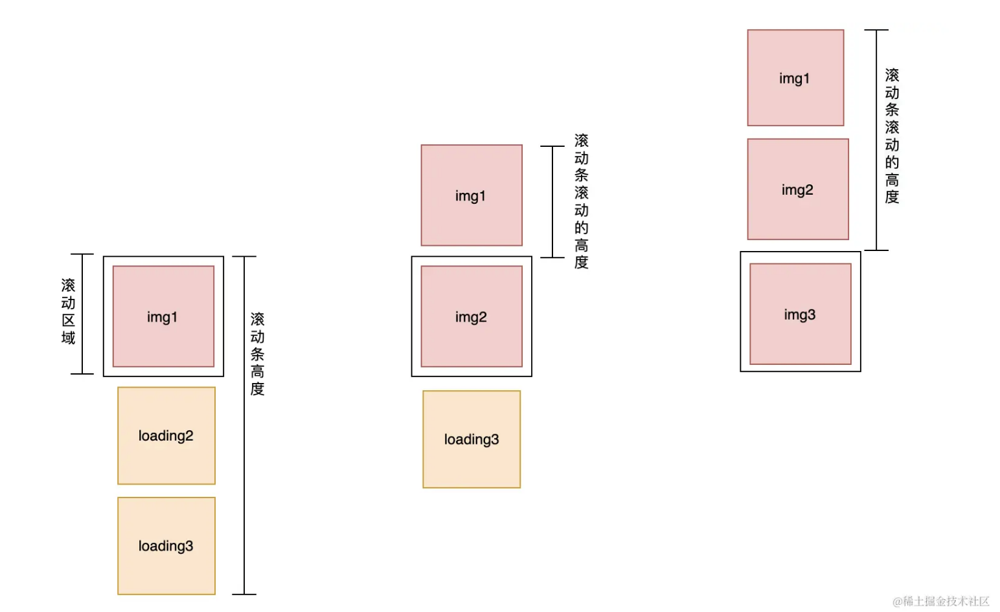

## 前言

图片懒加载是一种优化网页性能的技术，它允许在用户滚动到图片位置之前延迟加载图片。通过懒加载，可以在用户需要查看图片时才加载图片，避免了不必要的图片加载，从而提高了网页的加载速度和用户体验。

## 方案一

### `实现思路`

在说明思路之前，先了解几个常见的视图属性。

1. **clientHeight**：可视区域的高度，对应的也就是下图中的滚动区域。
2. **scrollTop**：滚动条滚动的高度，它指的是内容区的顶部到可视区域顶部的距离。
3. **offsetTop**：元素到 offsetParent 顶部的距离。
4. **offsetParent**：距离元素最近的一个具有定位的祖宗元素（relative，absolute，fixed），若祖宗都不符合条件，offsetParent 为 body。

图解：


根据上面的图解可知，当图片的滚动条滚动的高度加上可视区域的高度大于当前的图片的 offsetTop，那么说明图片正在进入可视区域。这个时候便可以加载当前图片。

### `第一步`

模拟后台返回的图片 url，遍历产生一个 url 集合，用于后面的懒加载使用。

```js
const imgUrls = (num = 10) => {
  const urls = []
  for (let i = 0; i < num; i++) {
    const url = `https://robohash.org/${i}.png`
    urls.push(url)
  }
  return urls
}
```

### `第二步`

遍历图片 url 集合，渲染 100 张 loading 图片，css 部分省略。

```html
    <div className={styles['box-one']} ref={scrollRef}>
      {imgUrls(100).map((item) => {
        return ;
      })}
    </div>
```

### `第三步`

监听容器的滚动事件，当容器滚动时计算容器的高度加上滚动条的高度大于当前图片的 offsetTop 时加载当前的图片。完整代码如下：

```tsx
import loadingUrl from '@/assets/imgs/loading.jpg'
import { useEffect, useRef } from 'react'
import styles from '../index.less'

// 图片url
const imgUrls = (num = 10) => {
  const urls = []
  for (let i = 0; i < num; i++) {
    const url = `https://robohash.org/${i}.png`
    urls.push(url)
  }
  return urls
}

const LazyLoading = () => {
  const scrollRef = useRef({} as any)

  // 滚动事件
  const changeScroll = () => {
    const clientHeight = scrollRef?.current.clientHeight //可视区域高度
    const scrollTop = scrollRef?.current.scrollTop //滚动条滚动高度
    const childNodes = scrollRef?.current.childNodes // 获取所有图片集合

    for (let j = 0; j < childNodes.length; j++) {
      const element = childNodes[j]
      if (scrollTop + clientHeight > element.offsetTop) {
        element.src = element.getAttribute('data-src') // 替换当前的src
      }
    }
  }

  useEffect(() => {
    changeScroll() // 第一次渲染的时候替换loading图片
  }, [])

  return (
    <div className={styles['box-one']} ref={scrollRef} onScroll={changeScroll}>
      {imgUrls(100).map(item => {
        return 
      })}
    </div>
  )
}

export default LazyLoading
```

上面的代码每次滚动事件会触发一系列计算，所以对上面的代码进行优化如下：

```js
const FirstLazyload = () => {
  const scrollRef = useRef(null)
  const [count, setCount] = useState(0)

  const changeScroll = () => {
    const clientHeight = scrollRef.current.clientHeight // 可视区域的高度
    const scrollTop = scrollRef?.current.scrollTop //滚动条滚动高度
    setCount(Math.ceil(scrollTop / clientHeight))
  }

  const initPage = num => {
    const childNodes = scrollRef?.current.childNodes // 获取所有图片集合
    const element = childNodes[num] // 当前加载到第几个
    element.src = element.getAttribute('data-src') // 替换当前的src
  }

  useEffect(() => {
    initPage(count)
  }, [count])
  return (
    <div>
      <p>1. 监听页面的滚动事件</p>
      <div className="imgGroups" ref={scrollRef} onScroll={changeScroll}>
        {imgUrls(100).map(item => {
          return 
        })}
      </div>
    </div>
  )
}
```

## 方案二

### `实现思路`

方案二的实现思路利用浏览器提供的 `IntersectionObserver` API 实现。`IntersectionObserver` API 提供了一种方便的方式来监视目标元素和其祖先元素或视窗之间的交叉状态变化。当目标元素进入或离开视口时，可以触发回调函数，进行相应的操作。它的原理是通过注册一个回调函数来观察特定元素的交叉状态变化，并在满足条件时执行相应的操作。

使用 `IntersectionObserver` API 非常简单，可以通过创建一个 `IntersectionObserver` 实例，并传入回调函数和选项对象来实现。回调函数会在目标元素的交叉状态发生变化时被调用，并接收一个参数，包含有关交叉状态的信息。

### `实现完整代码`

```tsx
import loadingUrl from '@/assets/imgs/loading.jpg'
import styles from '../index.less'
import React, { useRef, useEffect, useState } from 'react'
// 图片url
const imgUrls = (num = 10) => {
  const urls = []
  for (let i = 0; i < num; i++) {
    const url = `https://robohash.org/${i}.png`
    urls.push(url)
  }
  return urls
}

const LazyLoadImage = ({ src, alt }) => {
  const [imageSrc, setImageSrc] = useState(loadingUrl)
  const imgRef = useRef(null as any)

  useEffect(() => {
    let observer: IntersectionObserver
    if (imgRef.current) {
      // 创建IntersectionObserver实例
      observer = new IntersectionObserver(
        ([entry]) => {
          // 当图片进入可视区域时，设置图片地址进行加载
          if (entry.isIntersecting) {
            setImageSrc(src)
            observer.unobserve(imgRef.current)
          }
        },
        {
          rootMargin: '0px 0px 200px 0px', // 可视区域的上边距设置为200px
        },
      )
      observer.observe(imgRef.current) //开始观察目标元素
    }
    return () => {
      if (observer && observer.unobserve) {
        observer.unobserve(imgRef.current)
      }
    }
  }, [src])

  return 
}

const LazyLoading = () => {
  return (
    <div className={styles['box-two']}>
      {imgUrls(100).map(item => {
        return <LazyLoadImage src={item} alt="lazy load image" />
      })}
    </div>
  )
}

export default LazyLoading
```

### `注意事项`

在初始化的时候，需要给 imageSrc 设置一个初始化的 loading 地址，如果没有的话，初始化的时候会加载多张图片。

## 方案三

### `实现思路`

利用 react 的懒加载库`react-lazyload`，在使用之前需要先安装 `yarn add react-lazyload`，这里介绍几个它的常见属性：

1. scrollContainer: 指定的滚动的区域，默认值是 undefined，如果没有指定默认是窗口的视图作为滚动区域。
2. offset: 元素距离视口顶部的距离，当达到这个距离时，元素将被加载。
3. scroll: 是否监听滚动
4. height: 渲染元素的占位符的高度。
5. overflow : 如果溢出容器，延迟加载组件

#### `代码实现`

因为这里实现的图片懒加载是局部懒加载，所以需要指定 `scrollContainer`，`scrollContainer` 的值 DOM 对象。在实现的过程中，同时需要设置 overflow 为 true，以及 height 的值。

```tsx
import react, { useRef, useEffect } from 'react'
import LazyLoad from 'react-lazyload'
import styles from '../index.less'

// 图片url
const imgUrls = (num = 10) => {
  const urls = []
  for (let i = 0; i < num; i++) {
    const url = `https://robohash.org/${i}.png`
    urls.push(url)
  }
  return urls
}

const LazyLoading = () => {
  const scrollRef = useRef({} as any)

  return (
    <div className={styles['box-three']} ref={scrollRef}>
      {imgUrls(100).map(item => {
        return (
          <LazyLoad
            height={200}
            overflow={true}
            offset={0}
            key={item}
            scroll={true}
            scrollContainer={scrollRef.current} // DOM
          >
            
          </LazyLoad>
        )
      })}
    </div>
  )
}

export default LazyLoading
```
