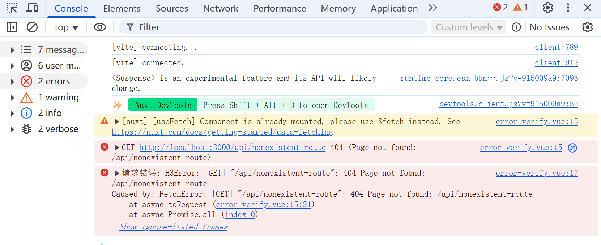

## 在nuxt中如何进行错误捕获和处理？

在 Nuxt.js 应用中，有效的错误处理机制对于提升用户体验和应用稳定性至关重要。Nuxt.js 提供了多层次的错误处理方案，从全局错误捕获到组件级别的精细控制。本文将详细介绍 Nuxt.js 中的错误处理机制、最佳实践以及实际应用场景。

## 全局错误处理机制？

全局错误处理器用于捕获来自任何组件的未处理错误，实现错误的集中管理和日志记录。

1. 将下面的配置在插件或者nuxt配置中进行设置

```js
export default defineNuxtPlugin(nuxtApp => {
  nuxtApp.vueApp.config.errorHandler = (error, instance, info) => {
    // 处理错误，例如上报到监控服务
    console.error('Global Error Captured:', error)
    // 返回false可阻止错误继续传播
    return false
  }
})
```

2. 在vue组件中主动抛出一个错误，例如：

```vue
<template>
  <UButton color="error" @click="throwError">触发错误</UButton>
</template>

<script setup>
  // 验证组件错误
  const throwError = () => {
    throw new Error('测试全局错误处理')
  }
</script>
```

3. 点击按钮后，检查控制台是否输出了全局错误处理插件中定义的日志（如 Global Error Captured）。如果控制台显示自定义错误日志，则说明 errorHandler已生效。
   

4. 或者使用 useFetch或 axios发起一个会失败的请求，例如：

```js
const { error } = await useFetch('/api/nonexistent-route')
if (error.value) {
  console.error('请求错误:', error.value)
}
```

5. 验证错误是否被全局捕获并处理。
   

::: details 全局错误处理器可以捕获以下类型的错误：

1. 组件渲染错误
2. 事件处理器错误
3. 生命周期钩子错误
4. setup() 函数错误
5. 侦听器错误
6. 自定义指令钩子错误
7. 过渡钩子错误
   :::

## 创建错误页面 (error.vue)

1. 在项目根目录添加 error.vue可以自定义全屏错误页面。当 Nuxt 遇到致命错误时(服务器未处理错误或客户端 fatal: true 错误)，会渲染此页面。

```html
<template>
  <div>
    <h2>{{ error.statusCode }}</h2>
    <p>{{ error.message }}</p>
    <button @click="handleError">返回首页</button>
  </div>
</template>

<script setup>
  const props = defineProps({
    error: Object,
  })

  const handleError = () => clearError({ redirect: '/' })
</script>
<!-- ...此处省略样式 -->
```

2. 使用 clearError函数可以清除错误状态并重定向到安全页面。注意：在使用任何依赖于插件的功能(如route或useRouter)前，应先检查错误状态，因为插件抛出错误后如果不调用clearError，插件将不会再次执行。
