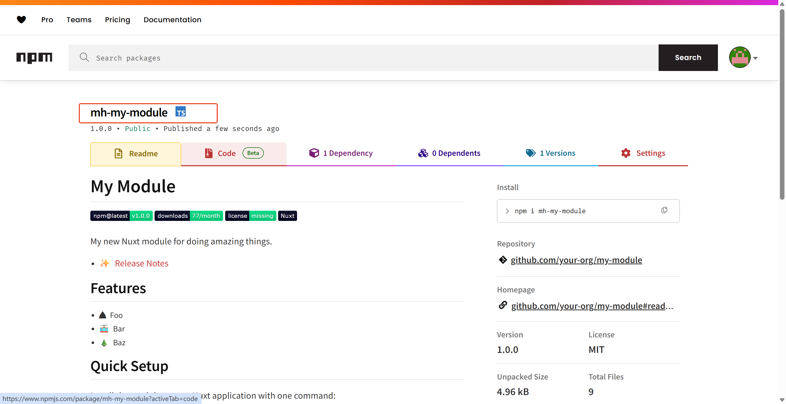

## nuxt模块开发初体验

### 前言:

Nuxt 模块是用于​​扩展 Nuxt 应用功能​​的可复用代码单元，本质上是能修改 Nuxt 配置或注入功能的函数/对象。

### 特点：

**即插即用​​：** 通过 nuxt.config.ts的 modules数组引入
**​​功能扩展​​：** 可添加组件、插件、API路由、样式等
**​​生态共享​​：** 能发布为 npm 包供他人使用

## 快速入门：

nuxt中提供了一种快速创建模块模板的方式：

```js
npm create nuxt -- -t module my-module
```

通过执行上面的命令将创建一个 my-module 项目，其中包含开发和发布模块所需的所有样板，my-module的目录结构如下：

```
my-module/
├── src/
│ └── module.ts # 模块的主入口文件
├── test/
│ └── module.test.ts # 模块的测试文件
├── package.json # 项目的依赖和元信息
├── tsconfig.json # TypeScript 配置
├── eslint.config.mjs # ESLint 配置
└── README.md # 项目说明文档
```

#### 核心文件 src/module.ts详解

这个文件导出了一个默认的函数，这是你的模块的核心。Nuxt 在启动时会调用这个函数。

```ts
// src/module.ts
import { defineNuxtModule, addPlugin, createResolver } from '@nuxt/kit'

// 导出模块
export default defineNuxtModule({
  // 模块的元数据
  meta: {
    name: 'my-module',
    configKey: 'myModule',
    compatibility: {
      // 指定与 Nuxt 版本的兼容性
      nuxt: '^3.0.0',
    },
  },
  // 模块的默认配置
  defaults: {
    // 这里可以定义你的模块的默认配置选项
    enabled: true,
    someOption: 'default-value',
  },
  // 模块的安装设置函数
  setup(options, nuxt) {
    // 这是模块的主要逻辑所在之处

    // 1. 使用 @nuxt/kit 的工具函数
    const resolver = createResolver(import.meta.url)

    // 2. 检查模块是否被禁用（根据用户配置）
    if (options.enabled === false) {
      return // 如果模块被禁用，则直接返回
    }

    // 3. 添加一个插件！
    // 这是模块最常见的操作之一。
    // 插件会在 Nuxt App 运行时加载。
    addPlugin(resolver.resolve('./runtime/plugin'))

    // 4. 你可以在这里做很多其他事情：
    // - 添加服务器路由 (addServerHandler)
    // - 添加 Nitro 插件 (extendNitro)
    // - 添加 Vue 插件 (addPlugin, addImports)
    // - 修改 Nuxt 配置 (nuxt.options)
    // - 添加自定义的 TypeScript 类型定义 (addTypeTemplate)
    // - 等等...
  },
})
```

#### 开发模块功能

在上面的 module.ts 文件中已经引入了nuxt插件，下面编写nuxt插件：

```ts
// src/runtime/plugin.ts
export default defineNuxtPlugin(nuxtApp => {
  // 这是一个 Nuxt 插件
  // 你可以在这里注入应用级别的逻辑、辅助函数、Vue 指令等。

  return {
    provide: {
      // 向所有 Vue 组件注入一个名为 `$hello` 的方法
      hello: (msg: string) => `Hello from my module! ${msg}`,
    },
  }
})
```

#### 添加配置选项

模块的强大之处在于可配置性。你已经在 defaults中定义了默认选项。用户可以在他们的 nuxt.config.ts中覆盖这些选项。

```ts
// 用户的 nuxt.config.ts
export default defineNuxtConfig({
  modules: ['my-module'],
  myModule: {
    // 这个键名对应模块 meta 中的 `configKey`
    enabled: true,
    someOption: 'user-value', // 覆盖默认值
  },
})
```

同时在modules也支持第二种写法：

```ts
// 用户的 nuxt.config.ts
export default defineNuxtConfig({
  modules: [
    [
      'my-module',
      {
        enabled: true,
        someOption: 'user-value', // 覆盖默认值
      },
    ],
  ],
})
```

在模块的 setup 函数中，你可以通过 options参数访问到用户的最终配置。

#### 本地测试你的模块

在发布到 npm 之前，你需要在另一个 Nuxt 项目中进行本地测试。

1. 在模块目录下，使用 npm link​​：

```
cd path/to/my-module
npm link
```

2. ​​在测试用的 Nuxt 项目目录下，链接你的模块​​：

```
cd path/to/nuxt-project
npm link my-module
```

3. ​​在测试项目中使用模块提供的功能​​：
   在任何 Vue 组件中，你现在可以使用插件注入的方法：

```vue
<script setup lang="ts">
  const { $hello } = useNuxtApp()
  console.log($hello('World')) // 输出: "Hello from my module! World"
</script>
```

4. ​​重启开发服务器​​：确保你的测试项目重启了 npm run dev以使模块更改生效。

以上就是本地进行开发和测试模块的过程。

## 构建与发布：

当你开发完成并测试通过后，就可以发布到 npm 了。

1.  ​​构建​：模块项目通常不需要构建步骤，因为 Nuxt Kit 工具链会处理它。但如果你有自定义的构建流程，可以配置 package.json中的 scripts。
2.  登录 npm​​： `npm login`
3.  发布： `npm publish` ,值得注意的是发布的时候需要检查一下发布的包的可用性：`npm view @mh/my-module`如果返回404，说明名称可用（这是预期结果）
4.  我这里使用的名称有重名的，需要修改下名称，同时配置一下发布的包是公共的普通包，私有的包是需要付费的。

```json
{
  "name": "mh-my-module",
  "version": "1.0.0",
  "publishConfig": {
    "access": "public"
  }
}
```

5. 发布成功之后在npm的个人账号就可以看到自己发布的包
   

6. 在nuxt项目中更改包的名称，并通过npm下载最新的包，就可以看到nuxt模块中的内容了。
7. 在node_modules中可以查看包的信息。

```
node_modules/
└── mh-my-module/  # 已安装的模块包
    ├── dist/  # 构建输出目录 - 包含模块的核心运行时代码
    │   └── runtime/
    │   │   ├── module.d.mts # TypeScript 类型声明文件
    │   │   ├── module.json # 模块的元信息或配置
    │   │   ├── module.mjs # 模块的主要运行时逻辑（ES Module）
    │   │   └── types.d.mts # 额外的类型定义
    ├── node_modules # 该模块自身的依赖（如果有）
    ├── package.json
    ├── README.md
    └── ...
```
